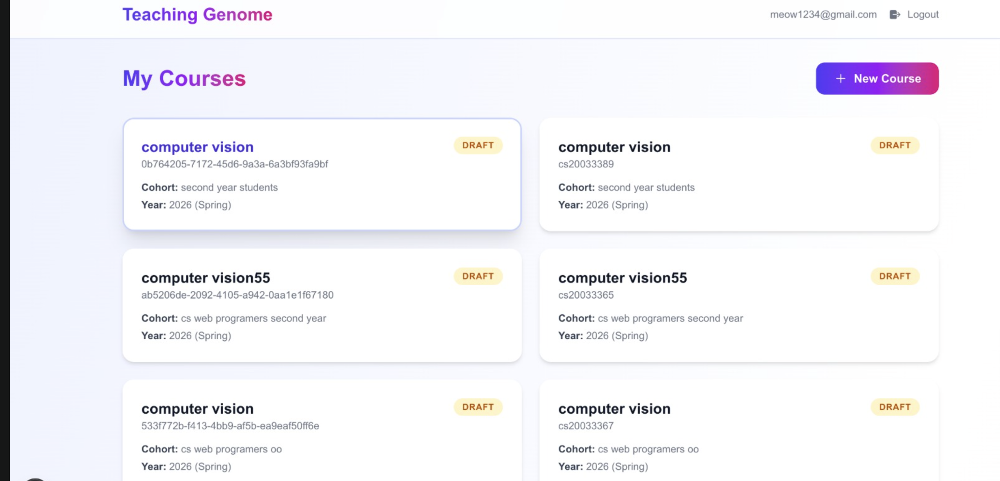
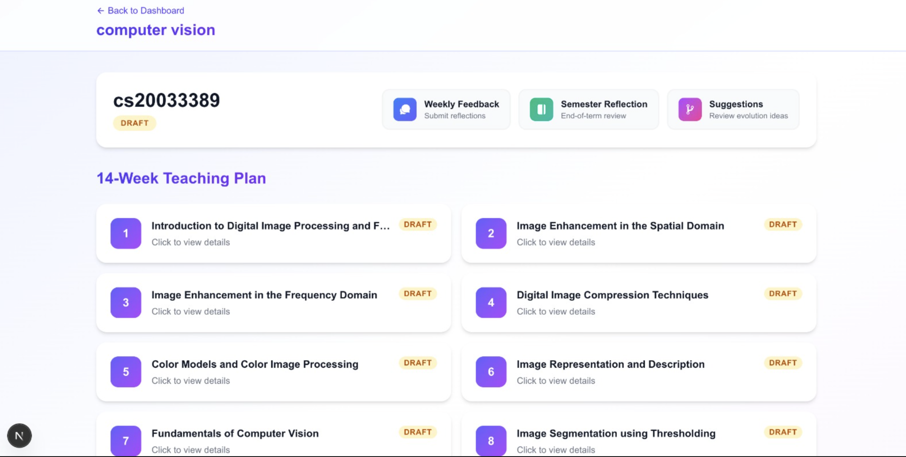
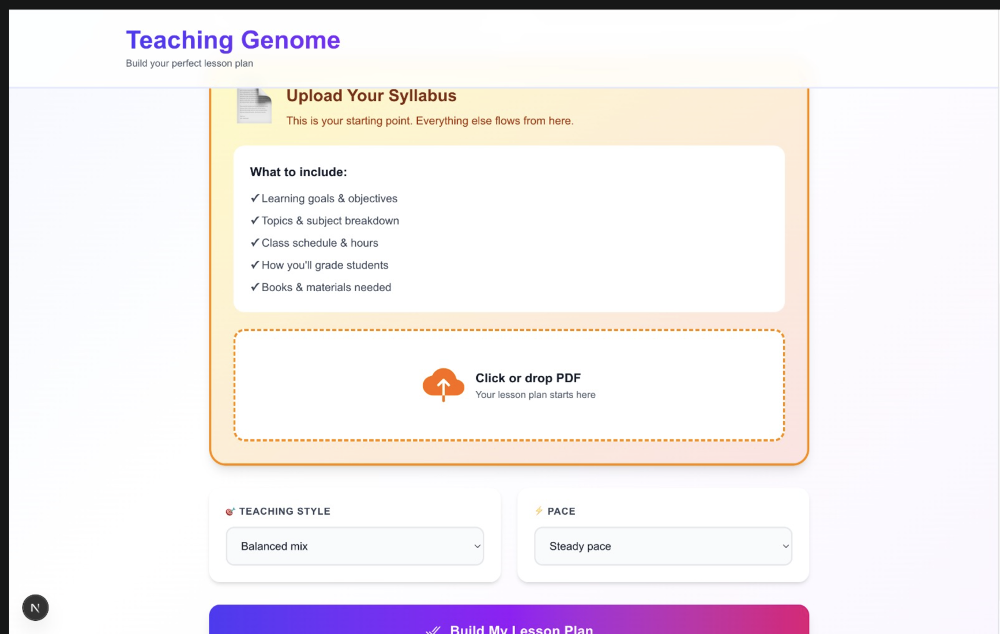
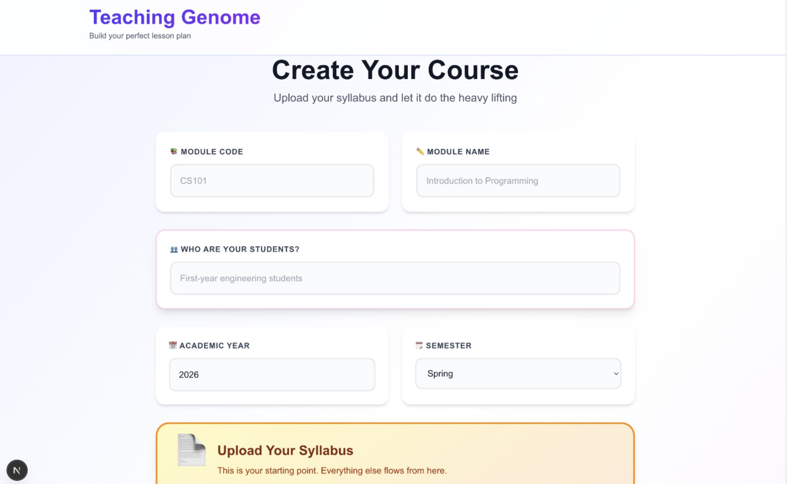
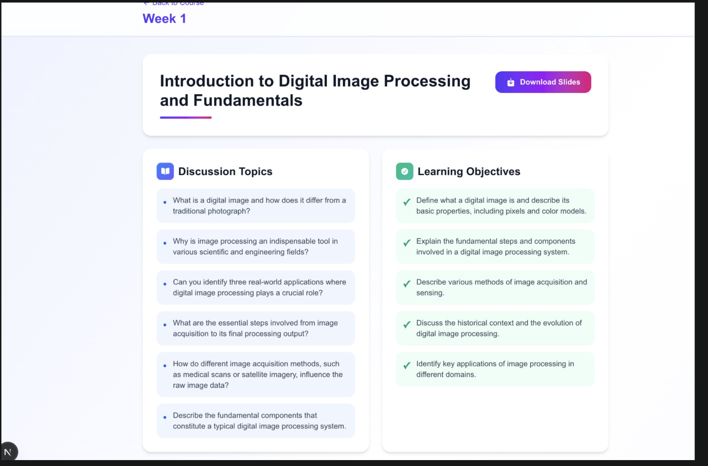
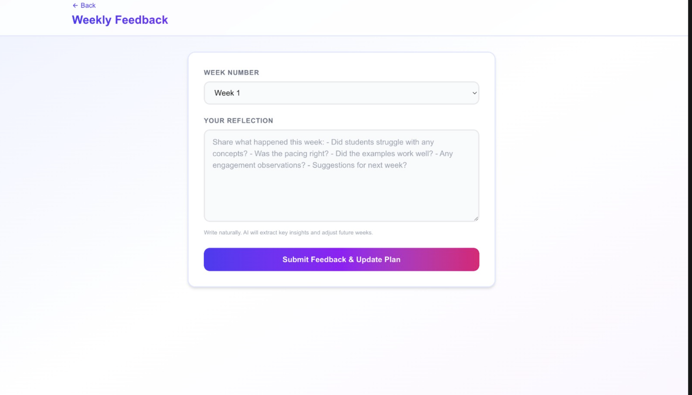
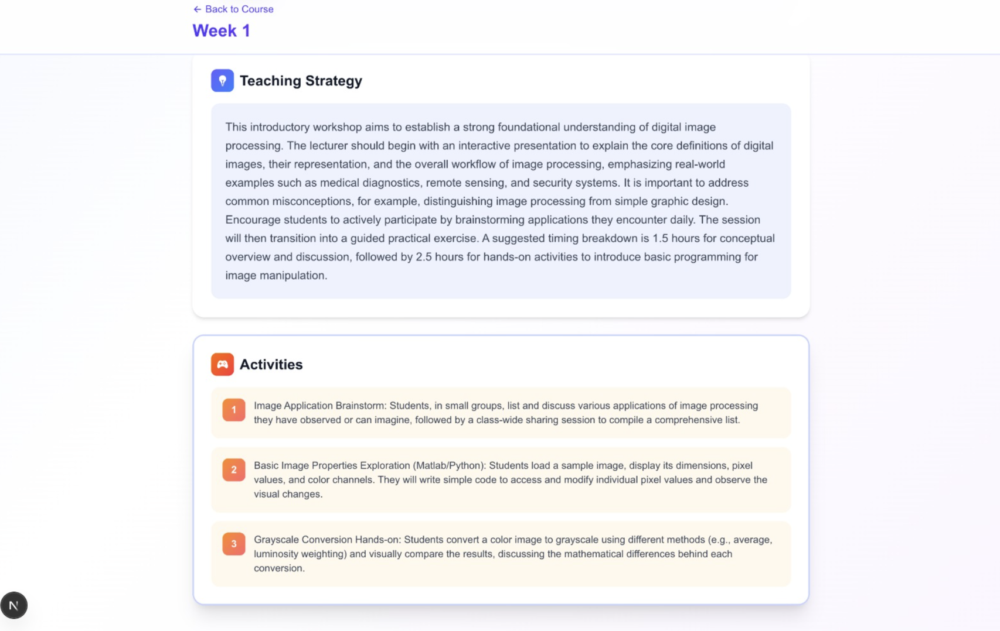

# Teaching Genome 🧬📚

> **Open-source AI lesson plan generator for educators**

Generate complete 14-week lesson plans with beautiful PDF slides in **minutes**, not weeks.

[](https://opensource.org/licenses/MIT)
[](https://github.com/anas318/teaching-genome)
[](https://www.typescriptlang.org/)
[](https://nextjs.org/)

---

## ✨ Features

- 🎓 **AI-Powered Planning** - Upload your syllabus, get a complete 14-week curriculum
- 📊 **Beautiful PDFs** - Professional slide decks generated for each week
- 🧠 **Gemini AI Integration** - Uses Google's latest AI for content generation
- 🔄 **Iterative Feedback** - Continuous improvement loop with evolution suggestions
- 🚀 **Zero External Dependencies** - PDF generation uses raw PDF operators (no APIs!)
- 🎨 **Modern UI** - Beautiful, responsive design built with Next.js & Tailwind
- 🔓 **Fully Open Source** - MIT license, deploy anywhere, modify freely
- 💾 **Self-Hosted** - Use Supabase (free tier) + n8n for complete autonomy

---

## 🚀 Quick Start

### Prerequisites
- **Node.js** 18+ 
- **npm** or **yarn**
- **Git**
- **Supabase** account (free tier available)
- **Google Gemini API** key (free tier available)
- **n8n** instance (self-hosted or cloud)

### Installation (5 minutes)

```bash
# 1. Clone repository
git clone https://github.com/anas318/teaching-genome.git
cd teaching-genome

# 2. Install dependencies
npm install

# 3. Create environment file
cp .env.example .env.local

# 4. Add your credentials (see Setup Guide below)
# Edit .env.local with your keys

# 5. Start development server
npm run dev

# 6. Open http://localhost:3000
```

---

## 📋 How It Works

```
┌─────────────────┐
│ 1. Upload PDF   │  Teacher uploads syllabus/module descriptor
└────────┬────────┘
         │
┌────────▼────────────────┐
│ 2. Parse & Store        │  Supabase saves course info
└────────┬────────────────┘
         │
┌────────▼──────────────────┐
│ 3. Trigger n8n Workflow  │  Webhook kicks off automation
└────────┬──────────────────┘
         │
┌────────▼─────────────────────────┐
│ 4. Generate Content (Gemini AI)  │  Prompts Gemini for 14-week plan
└────────┬─────────────────────────┘
         │
┌────────▼──────────────────────┐
│ 5. Build PDF with Raw Ops     │  Creates professional PDF slides
└────────┬──────────────────────┘
         │
┌────────▼──────────────┐
│ 6. Download PDF       │  User gets beautiful slides!
└───────────────────────┘
```

---

## 🛠️ Tech Stack

| Component | Technology |
|-----------|------------|
| **Frontend** | Next.js 16, TypeScript, Tailwind CSS, React Icons |
| **Database** | Supabase (PostgreSQL) |
| **Storage** | Supabase Storage |
| **Workflow** | n8n (automation & orchestration) |
| **AI** | Google Gemini 2.5 Flash API |
| **PDF Engine** | Raw PDF operators (no external libs) |
| **Deployment** | Vercel (frontend), Railway/Self-hosted (backend) |

---

## 📖 Documentation

- **[Setup Guide](./docs/SETUP.md)** - Detailed installation & configuration
- **[Architecture](./docs/ARCHITECTURE.md)** - How the system works
- **[Deployment](./docs/DEPLOYMENT.md)** - Deploy to production
- **[API Reference](./docs/API.md)** - Webhook endpoints
- **[Contributing](./CONTRIBUTING.md)** - How to contribute

---

## 🎯 Use Cases

### Teachers & Educators
- Generate lesson plans in minutes instead of weeks
- Create consistent, professional course materials
- Iterate based on student feedback

### Educational Institutions
- Standardize course creation process
- Reduce time-to-launch for new modules
- Maintain quality across departments

### Curriculum Designers
- Rapid prototyping of course structures
- A/B test different approaches
- Build on previous iterations

---

## 🌍 Global Impact

Teaching Genome is designed for:
- ✅ Busy teachers in resource-constrained environments
- ✅ Non-profit educational institutions
- ✅ Developing countries with limited curriculum resources
- ✅ Anyone who wants to open-source their teaching

**Free tier**: Fully functional for personal use
**Community**: Contributions welcome from educators worldwide

---

## 📊 Screenshots

### 1. Course Dashboard

Overview of all courses, status, and quick actions.

### 2. 14-Week Plan

Complete semester outline generated from a single upload.

### 3. Upload Form

Upload syllabus or module descriptor to start planning.

### 4. Create Course

Create a course profile with key metadata and goals.

### 5. Week Details

Weekly lesson breakdown with objectives and materials.

### 6. Weekly Feedback

Lecturer feedback form to refine future weeks.

### 7. Teaching Strategy

AI-generated strategies tailored to the course context.

---

## 🚀 Roadmap

### v1.0 (Current)
- ✅ Course upload & parsing
- ✅ 14-week lesson plan generation
- ✅ PDF slide generation
- ✅ Basic UI

### v1.1 (Next)
- [ ] Semester reflection and evaluation suggestions

---

## 🤝 Contributing

We ❤️ contributions! Whether it's bug reports, feature requests, or code contributions.

### Getting Started
1. Fork the repository
2. Create feature branch: `git checkout -b feature/amazing-feature`
3. Commit changes: `git commit -m "Add amazing feature"`
4. Push: `git push origin feature/amazing-feature`
5. Open Pull Request

See [CONTRIBUTING.md](./CONTRIBUTING.md) for detailed guidelines.

### Good First Issues
Looking to contribute? Start with these:
- [ ] [Add dark mode support](https://github.com/anas318/teaching-genome/issues)
- [ ] [Improve README with demo video](https://github.com/anas318/teaching-genome/issues)
- [ ] [Add Spanish language support](https://github.com/anas318/teaching-genome/issues)
- [ ] [Create Docker setup guide](https://github.com/anas318/teaching-genome/issues)

---

## 📄 License

This project is licensed under the MIT License - see [LICENSE](./LICENSE) file for details.

This means you can:
- ✅ Use it commercially
- ✅ Modify it
- ✅ Distribute it
- ✅ Use it privately

The only requirement: include the license notice.

---

## 🙏 Credits

- Built by educators, for educators
- Powered by [Google Gemini API](https://ai.google.dev/)
- Infrastructure by [Supabase](https://supabase.com/) & [n8n](https://n8n.io/)
- Designed with [Tailwind CSS](https://tailwindcss.com/)

---

## 📞 Support

### Getting Help
1. **Check the [Setup Guide](./docs/SETUP.md)**
2. **Search [existing issues](https://github.com/anas318/teaching-genome/issues)**
3. **Join [Discussions](https://github.com/anas318/teaching-genome/discussions)**
4. **Report a bug** via [Issues](https://github.com/anas318/teaching-genome/issues/new)

### Found a Bug?
Please open an issue with:
- Clear description
- Steps to reproduce
- Screenshots if applicable
- Your environment (OS, Node version, etc.)

---

## ⭐ Show Your Support

If Teaching Genome helps you, please:
- ⭐ Star this repository
- 🐦 Share on Twitter
- 📢 Tell other educators
- 🤝 Contribute code or ideas

Your support helps us reach more teachers! 🙌

---

## 📊 Project Stats


---

## 🌟 Built for the Global Teaching Community

Teaching Genome is part of the movement to democratize education technology. We believe every teacher deserves access to AI-powered tools, regardless of their budget or tech literacy.

**If you're an educator, this is YOUR tool. Help us make it better.** 🚀

---

<div align="center">

**Made with ❤️ for educators worldwide**

[Get Started](#-quick-start) • [Documentation](./docs/) • [Contribute](./CONTRIBUTING.md) • [Discuss](https://github.com/anas318/teaching-genome/discussions)

</div>
